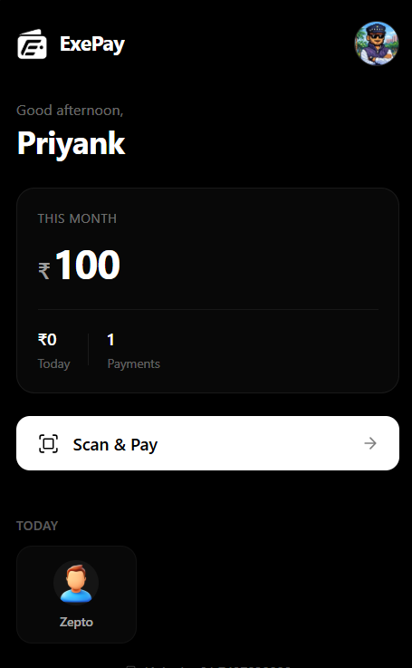
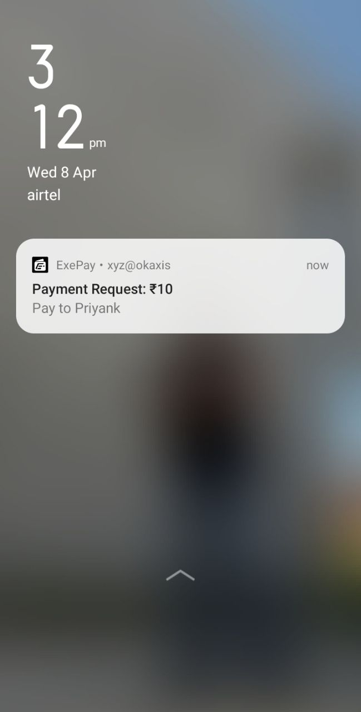

# ExePay

<p align="center">
  
</p>

<p align="center">
  <strong>Scan QR codes on desktop. Pay from your phone.</strong>
</p>

ExePay bridges the gap between desktop browsing and mobile payments. When you encounter a UPI QR code on your laptop or desktop, ExePay lets you scan it with a Chrome extension and instantly sends the payment request to your Android phone for completion.

## Table of Contents

- [Overview](#overview)
- [Payment Approach](#payment-approach)
- [Architecture](#architecture)
- [Components](#components)
- [Installation](#installation)
- [Usage Flow](#usage-flow)
- [Tech Stack](#tech-stack)
- [Project Structure](#project-structure)
- [Development](#development)
- [License](#license)

## Overview

ExePay solves a common problem: you're browsing on your desktop, find a product or service to pay for, and see a UPI QR code. Currently, you need to either pull out your phone and manually scan the screen, or transfer the payment details manually. ExePay automates this process.

## Payment Approach

### Ideal Approach: Direct Bank-to-Bank

The optimal solution would function as a payment facilitator, enabling direct bank-to-bank transfers similar to how platforms like Zepto or other quick commerce apps handle payments. When a user scans a QR code, the extension would initiate the payment directly from their linked bank account to the merchant's account.

However, this approach requires:
- Reserve Bank of India (RBI) payment aggregator license
- Integration agreements with multiple banks
- Compliance with NPCI guidelines for UPI
- Significant regulatory and compliance infrastructure

These requirements make direct payment processing unsuitable for an MVP phase.

### Current Approach: Mobile Bridge

For the MVP, ExePay uses a bridge architecture:

1. The Chrome extension scans and parses UPI QR codes
2. Payment details are sent to Firebase Firestore
3. The Android companion app receives the payment request
4. The user completes payment using their preferred UPI app on mobile

This approach:
- Requires no payment licenses
- Leverages existing UPI apps for actual transaction processing
- Provides a functional proof-of-concept
- Can be upgraded to direct payments when regulatory requirements are met

<p align="center">
  
</p>

<p align="center">
  
</p>

## Architecture

```
+-------------------+         +-------------------+         +-------------------+
|                   |         |                   |         |                   |
|  Chrome Extension |  --->   |  Firebase Cloud   |  --->   |   Android App     |
|  (QR Scanner)     |         |  (Firestore)      |         |  (Payment Bridge) |
|                   |         |                   |         |                   |
+-------------------+         +-------------------+         +-------------------+
        |                             |                             |
        v                             v                             v
   Scan QR Code              Store Payment Request           Receive Notification
   Parse UPI Data            Real-time Sync                  Open UPI Intent
   Send to Cloud             User Authentication             Complete Payment
```

### Data Flow

1. User encounters a UPI QR code on any website
2. Clicks the ExePay extension icon and scans the QR code
3. Extension parses UPI URI and extracts merchant details
4. Payment request is created in Firestore with status "pending"
5. Android app receives real-time update via Firestore listener
6. App displays notification and payment details
7. User taps to open their preferred UPI app with pre-filled data
8. After payment, user marks the request as completed
9. Status syncs back to extension for confirmation

## Components

### Chrome Extension (exepay-v2)

The browser extension provides:
- QR code scanning via device camera
- UPI URI parsing and validation
- Secure user authentication with PIN
- Payment request creation and status tracking
- Real-time status updates from mobile

### Android App (exepay-android)

The companion mobile app provides:
- Real-time payment request notifications
- Dashboard showing pending and completed payments
- UPI intent launching to any installed payment app
- Payment status management
- User profile with Cloudinary image support

## Installation

### Chrome Extension

1. Clone the repository
2. Navigate to the extension directory:
   ```bash
   cd exepay-v2
   ```
3. Install dependencies:
   ```bash
   npm install
   ```
4. Build the extension:
   ```bash
   npm run build:extension
   ```
5. Open Chrome and navigate to `chrome://extensions`
6. Enable "Developer mode"
7. Click "Load unpacked" and select the `dist` folder

### Android App

1. Open the `exepay-android` folder in Android Studio
2. Sync Gradle dependencies
3. Add your `google-services.json` file to `app/` directory
4. Build and run on a device or emulator

### Firebase Setup

1. Create a Firebase project at console.firebase.google.com
2. Enable Authentication (Email/Password)
3. Enable Firestore Database
4. Add your Firebase configuration to both projects
5. Deploy Firestore security rules:
   ```bash
   firebase deploy --only firestore:rules
   ```

## Usage Flow

1. Install the Chrome extension and Android app
2. Create an account and set a 4-digit PIN
3. Log in on both platforms with the same credentials
4. When you see a UPI QR code on your desktop:
   - Click the ExePay extension icon
   - Enter your PIN
   - Click "Scan QR Code"
   - Point your camera at the QR code
   - Review the payment details
   - Click "Send to Mobile"
5. On your Android phone:
   - Receive notification of pending payment
   - Tap to view details
   - Click "Pay Now" to open your UPI app
   - Complete the payment
   - Mark as done in ExePay

## Tech Stack

### Extension
- React 18 with TypeScript
- Vite for building
- Zustand for state management
- Firebase SDK for authentication and Firestore
- Framer Motion for animations
- html5-qrcode for QR scanning

### Android App
- Kotlin
- Jetpack Compose for UI
- Material Design 3
- Firebase Authentication and Firestore
- Coil for image loading
- Coroutines for async operations

### Backend
- Firebase Authentication
- Cloud Firestore (real-time database)
- Cloudinary (profile image storage)

## Project Structure

```
exepay/
├── exepay-v2/                # Chrome Extension
│   ├── public/
│   │   ├── icons/            # Extension icons
│   │   └── manifest.json     # Chrome extension manifest
│   ├── src/
│   │   ├── components/       # React components
│   │   ├── pages/            # Page components
│   │   ├── services/         # Firebase and API services
│   │   ├── store/            # Zustand state management
│   │   ├── styles/           # CSS styles
│   │   └── types/            # TypeScript types
│   ├── scripts/              # Build scripts
│   └── dist/                 # Built extension (load this in Chrome)
│
├── exepay-android/           # Android App
│   ├── app/
│   │   └── src/main/
│   │       ├── java/.../exepay/
│   │       │   ├── ui/       # Compose UI screens
│   │       │   ├── data/     # Data models
│   │       │   └── util/     # Utility classes
│   │       └── res/          # Resources
│   └── gradle/               # Gradle configuration
│
└── docs/                     # Documentation and images
```

## Development

### Extension Development

```bash
cd exepay-v2

# Install dependencies
npm install

# Start development server
npm run dev

# Build for production
npm run build:extension

# Type checking
npm run typecheck
```

### Android Development

Open the `exepay-android` project in Android Studio and use the standard build/run workflow.

### Environment Variables

Create appropriate configuration files:
- Extension: Firebase config in `exepay-v2/src/services/firebase.ts`
- Android: `google-services.json` in `exepay-android/app/` directory

## License

This project is proprietary software. All rights reserved.
